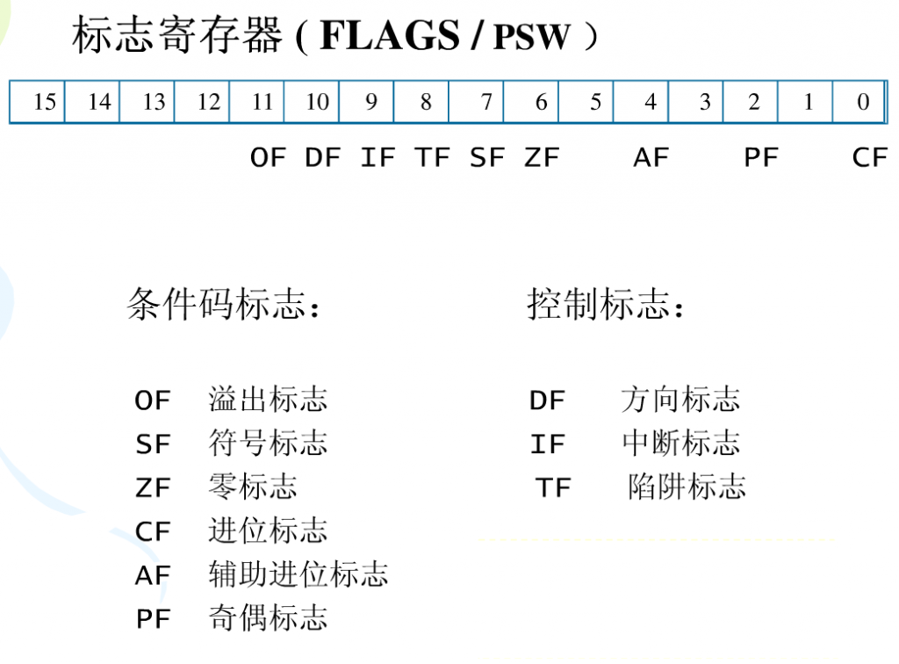

# 通用寄存器

eax 累加器  
ecx 基址寄存器count   
ebx 计数器 base  
edx 存放数据data 
esp 堆栈指针stack pointer  
ebp 基址指针base pointer  
esi 源变址 source index  
edi 目标变址 destination index  

# 段寄存器
cs  
ds  
ss  
es  
fs  
gs  

# 状态控制寄存器

eflags  
eip 指令指针  
cr0 机器状态字  
cr1 保留  
cr2 页故障地址  
cr3 页目录地址  

# eflags

